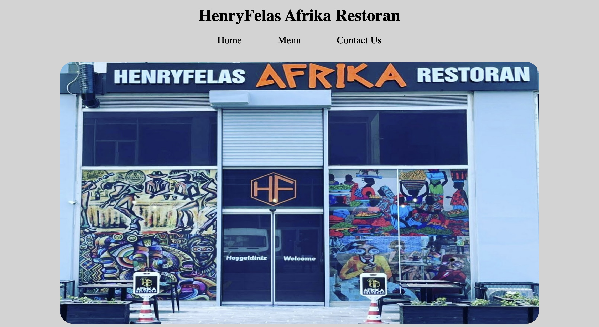

# Restaurant

## Description:
This project is a restaurant menu app built with webpack.
The app allows users to view menu items.

Live Demo: 
https://prosperjohn9.github.io/restaurant/dist/index.html

Desktop View:

This project was created for the [Restaurant Page](https://www.theodinproject.com/lessons/node-path-javascript-restaurant-page) assignment as part of The Odin Project curriculum.